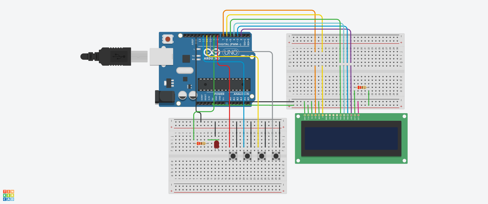

# arduino-alarm-clock

Alarm clock made with Arduino using a 16x2 LCD.  
Current hour and minute are shown on the display. There are 4 buttons:
* "Select" button is responsible for enabling the "set alarm" mode
* "+" and "-" buttons are responsible for adding and subtracting minutes in the "set alarm" mode
* "Alarm" button which is responsible for enabling and disabling the alarm

The alarm is indicated by diode and on the display.

## Circuit design

## Components used

* WaveShare Uno Plus (compatible with Arduino Uno)
* LCD 16x2
* 2x 220Ω resistor
* 4x pushbuttons
* Red LED

## License

Copyright (c) 2020 by ***Kamil Marut***

`arduino-alarm-clock` is under the terms of the [MIT License](https://www.tldrlegal.com/l/mit), following all clarifications stated in the [license file](LICENSE).
